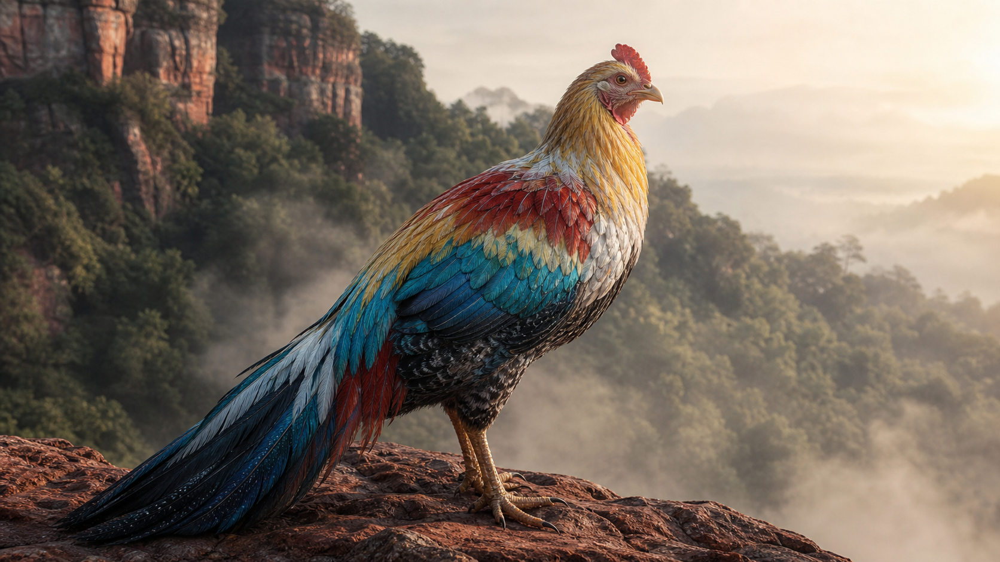
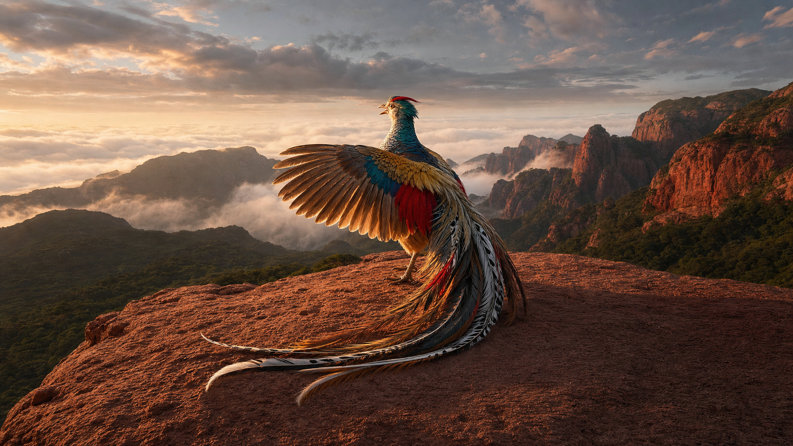
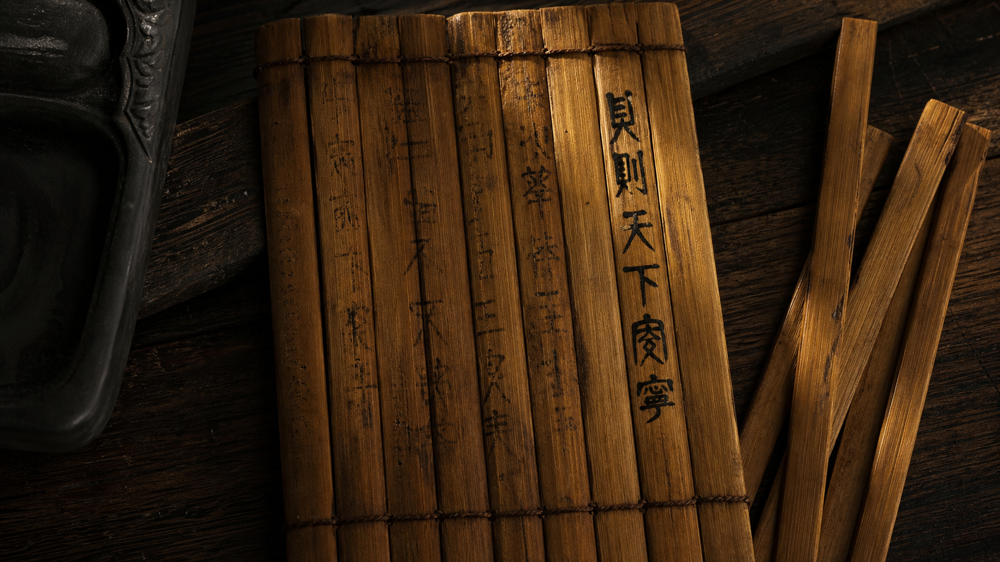

# 凤凰

**凤凰**是《山海经》中等级最高的神鸟，身上铭刻仁义礼智信五德，「饮食自然，自歌自舞」（001-031），出现即预示天下安宁。它不是后世那个模糊的吉祥符号，而是一只有明确栖息地（[[丹穴之山]]）、明确形态（如鸡）、明确行为模式的具体生物。

## 原文出处

引注：（001-031）

> 有鸟焉，其状如鸡，五采而文，名曰凤凰，首文曰德，翼文曰义，背文曰礼，膺文曰仁，腹文曰信。是鸟也，饮食自然，自歌自舞，见则天下安宁。

另见海内西经：「开明西有凤凰、鸾鸟，皆戴蛇践蛇，膺有赤蛇」（012-019），凤凰在[[昆仑]]体系中亦有登场，且与鸾鸟并列，均以驭蛇为标志，显示其在神圣地理中的核心地位。南山经另载凤凰与鸟族的聚集：「佐水出焉，而东南流注于海，有凤凰、鸟雏」（001-041），暗示凤凰不是孤立存在，而是鸟族聚落的领袖。

## 五德纹样

| 部位 | 纹字 | 含义 |
|------|------|------|
| 首（头） | 德 | 君德，统领 |
| 翼（翅） | 义 | 行义，展翅即行义 |
| 背 | 礼 | 守礼，承载秩序 |
| 膺（胸） | 仁 | 怀仁，内在品质 |
| 腹 | 信 | 守信，根基 |

凤凰是《山海经》中唯一以道德概念铭刻于身体的生物（001-031），它不代表某一种美德，而是五常的完整载体。

## 祥瑞鸟谱系

| 鸟 | 栖地 | 征兆 | 差异 |
|------|------|------|------|
| **凤凰** | [[丹穴之山]]（001-031） | 见则天下安宁 | 五德铭身，自歌自舞 |
| [[鸾鸟]] | [[女床之山]] | 见则天下安宁 | 五采文，无德字铭刻 |
| [[九凤]] | 大荒北野（大荒北经） | 凶异之鸟 | 九头，无祥瑞功能 |
| [[帝江]] | [[天山]]（西山经） | 无征兆属性 | 六足四翼，混沌之神 |

凤凰与[[鸾鸟]]同为太平征兆鸟，但凤凰更高一级，它不仅五彩斑斓，还将道德秩序写在了身体上。[[九凤]]虽同为多功能鸟族，但位于大荒北方，属性截然相反，大荒南方是凤凰的太平之域，大荒北方是九凤的险异之地，方位决定了鸟的属性。

## 凤凰在昆仑

海内西经的记载将凤凰置于更宏大的神圣空间中（012-019）。在昆仑开明兽以西的区域，凤凰与鸾鸟同驻，「膺有赤蛇」（012-019），胸前佩蛇而非佩玉，以蛇为饰物。这与南山经中「饮食自然，自歌自舞」的悠然形象截然不同：在昆仑，凤凰是武装的守护者；在丹穴之山，凤凰是自在的隐者。同一生物在不同空间呈现不同面貌。

## 凤凰与帝俊系统

《大荒南经》描述帝舜之子无淫的居地：「爰歌舞之鸟，鸾鸟自歌，凤鸟自舞，爰有百兽，相群爰处，百谷所聚」（011-014）。凤凰出现在帝舜后裔的乐土，「百兽相群、百谷所聚」的状态与凤凰「见则天下安宁」的征兆完全吻合。这意味着凤凰的出现不是孤立的吉兆，而是整个生态系统进入和谐状态的信号。

[[帝俊]]妻[[羲和]]生十日、[[常羲]]生月，[[帝俊]]在大荒东经的竹林中自成一系。后世传说将凤凰列为帝俊的使者或象征，《山海经》文本未明言这一关联，但两者的地理和语境存在隐性联系：凤凰出没的南方（[[丹穴之山]]），正是[[帝舜]]葬地（[[苍梧之山]]）所在的大方位，也是[[帝俊]]诸子族群定居的区域。

## 都广之野，凤凰的宇宙中心

《大荒西经》记载「爰有遗玉、青马、三骓、视肉、甘华，百谷所在，有木，其状如棠，黄叶而白皮，名曰帝屋……其下有稷，国曰都广，是谓土中」（016-012），都广之野是大地的中心。这一区域与「鸾鸟自歌、凤鸟自舞」的叙述相邻，凤凰的活跃场所集中于大地中轴附近。

南山经（001-031）的[[丹穴之山]]是凤凰的原生栖息地，但「见则天下安宁」的征兆性质意味着凤凰必须走出山林才能实现其预言价值。凤凰的行动轨迹分三段：栖居丹穴为常态，偶现人间为征兆，回归山林为终点，构成一个完整的「隐现」叙事周期。

## 凤凰与矿物世界的关联

[[丹穴之山]]，「丹穴」即朱砂矿坑，是《山海经》中以矿物命名山体的案例。朱砂（硫化汞）是红色颜料与炼丹的核心原料。凤凰栖居于矿产丰富的朱砂山，而非草木葱茏之地，与其五彩羽色（赤色主导）在视觉上相呼应。

相比之下，[[玉山]]（[[西王母]]居所）以玉命名，[[钟山]]以烛龙居所著称，《山海经》中神圣生物的栖息地往往与特定地质属性绑定，凤凰与[[丹穴之山]]的朱砂属性是这一规律的南山经版本。

## 凤凰与治水神话的隐性交叉

凤凰作为祥瑞生物，与《山海经》中的治水叙事存在一条隐藏的联系线索。海内经记载「鸾鸟自歌，凤鸟自儛」出现在[[都广之野]]（018-034），而同一段落提及「百谷自生，冬夏播琴」，这是洪水平定之后大地恢复丰饶的标志。[[禹]]治水成功，「卒布土以定九州」（018-038），九州安定的结果就是凤凰所预示的「天下安宁」。

换言之，凤凰的出现在叙事逻辑上是治水成功的后果信号。[[鲧]]窃[[息壤]]失败被杀，禹改疏导法成功，天下安宁，凤凰出现。凤凰不参与治水行动，却是治水叙事的终幕意象。这种「不在场的在场」使凤凰成为整个治水神话链条的句号。

从类型学角度看，《山海经》中的祥瑞生物（凤凰、[[麒麟]]、[[当康]]）与灾异生物（[[穷奇]]、[[梼杌]]、[[饕餮]]）构成严格的对立组。祥瑞生物的出现条件是秩序的恢复，灾异生物的出现条件是秩序的崩坏。凤凰位于这一对立结构的最高端，因为它携带的不只是「无灾」的消极信号，而是「五德俱全」的积极秩序。

## 凤凰的双重身份与[[不死之药]]的关联

海内西经记载凤凰出现在[[昆仑之丘]]开明西侧（012-019），而开明东侧是六巫手持[[不死之药]]守护窳尸的场景（012-021）。凤凰与不死之药分居昆仑的东西两翼，一个代表生命秩序的完美形态（五德），一个代表对死亡的抵抗（不死）。两者在空间上的对称布局暗示：昆仑的神圣性由两极支撑，西方是活的完美（凤凰），东方是死的悬置（不死之药）。

这一空间结构也暗示凤凰本身具有某种超越生死的属性。「饮食自然」意味着不依赖外部食物链，「自歌自舞」意味着不依赖社会互动，凤凰是一个自足的生命闭环。它不需要[[不死之药]]，因为它的存在方式本身已经逼近了「不死」的状态。

## 关联实体

- [[丹穴之山]]：凤凰的原生栖息地（001-031）
- [[鸾鸟]]：凤凰的近缘祥瑞鸟
- [[南山经]]：凤凰所在的经卷

- [[昆仑之丘]]：凤凰在昆仑体系中的另一驻所（012-019）
- [[帝俊]]：后世传说中凤凰为帝俊使者
- [[帝舜]]：大荒南经乐土中凤鸟出没的区域归属者

- [[九凤]]：大荒北方的对应鸟神，属性相反
- [[苍梧之山]]：帝舜葬地，与凤凰的南方活动范围重叠
- [[不死之药]]：昆仑东侧的不死力量，与凤凰构成东西对称
- [[禹]]：治水成功者，凤凰「天下安宁」征兆的叙事前提

## 神话意义

**道德秩序的生物化**：凤凰将抽象的五常（德义礼仁信）转化为可见的身体纹样（001-031），道德不再是概念，而是可以在一只鸟身上直接「看到」的东西。这种将抽象秩序物理化的思维，是《山海经》世界观的核心特征。

**「饮食自然」的不依赖**（001-031）：凤凰不食人间烟火，自给自足。它的出现标志太平，但它不属于人间，它是天道秩序的信使，短暂降临后即离去。

**南北对称**：凤凰（南方、五德、祥瑞）与[[九凤]]（北方、九头、险异）构成《山海经》鸟族神话的南北两极，同为多头/多能鸟的极端形态，却传递截然相反的宇宙信息。

## 纪录片关键帧

| 镜头 | 画面 |
|------|------|
| 丹穴晨景 |  |
| 凤凰初现 |  |
| 丹水饮水 |  |
| 自歌自舞 |  |
| 竹简安宁 |  |
| 走入山林 |  |

> 图片来源：纪录片制作包 · [查看完整脚本](../../../documentary/凤凰.md)

## 参见

- [[丹穴之山]]：凤凰的家
- [[鸾鸟]]：近缘祥瑞鸟
- [[九凤]]：北方对应鸟神
- [[帝舜]]：凤凰出没的南方大荒乐土的帝王
- [[不死之药]]：昆仑空间对称的另一极
